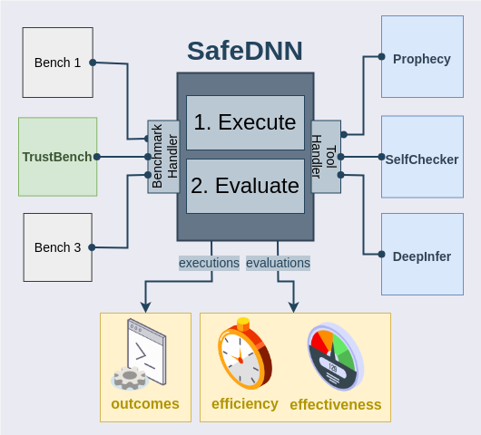

# A framework for evaluating tools that reason about the trustworthiness of the DNN's predictions.


## Overview



TrustDNN is a framework for evaluating tools that reason about the trustworthiness of the DNN's predictions. 
The framework is designed to be modular and extensible, allowing for the easy integration of new tools and benchmarks. 
TrustDNN provides a set of common interfaces for interacting with tools and benchmarks, as well as a set of common 
evaluation metrics for comparing the performance of different tools. The framework follows a two-step workflow 
(execute and evaluate). In the execute step, the analysis and inference phases are executed separately for each tool. 
The tools are expected to produce a file containing notifications as output after execution. Subsequently, during 
evaluation, the efficiency and effectiveness of the tools are measured by analyzing successful executions and their 
respective outputs. The framework is implemented in Python (>=3.9) and designed to be easy to use and easy to extend.

## Installation
TrustDNN is implemented in Python 3.10. To install the required packages, run:

```shell
#Optional: Create a virtual environment
$ python3.10 -m venv env
$ source env/bin/activate
$ pip install -r .
$ export TRUSTDNN_DIR=~/.trustdnn
$ mkdir $TRUSTDNN_DIR
$ cp -r config $TRUSTDNN_DIR
```

## Usage

### Execute Command

The `execute` command in TrustDNN facilitates running tools on datasets from specified benchmarks. This command is 
essential for offline analysis and inference tasks. Below is a comprehensive guide on how to use the `execute` command, 
along with examples demonstrating its usage.

#### Usage Syntax:
```shell
$ trustdnn execute [OPTIONS] COMMAND 
```

#### Command Options:
- -wd, --workdir: Specify the working directory for the execution. Default is the current directory.
- -b, --benchmark: Name of the benchmark to use.
- -t, --tool: Name of the tool to execute.
- -id: Identifier for the execution.
- -d, --datasets: Names of the datasets to use. Multiple datasets can be specified.
- -m, --models: Names of the target models. Multiple models can be specified.

#### Command Actions:
- analyze: Performs offline analysis of a tool on specified models/datasets from the benchmark.
- infer: Executes the tool for inference on specified models from the benchmark.

#### Examples:

1. Run Prophecy's analysis on tabular and image data:
```shell
$ trustdnn execute -id 1 -b trustbench -t prophecy -d BM GC HP PD CIFAR10 -wd /experiments/comparison analyze
```

2. Run Prophecy's inference on tabular and image data:
```shell
$ trustdnn execute -id 1 -b trustbench -t prophecy -d BM GC HP PD CIFAR10 -wd /experiments/comparison infer
```

> Note: Ensure that the specified benchmark, tool, datasets, and models exist within the TrustDNN framework. Adjust 
> the working directory and execution identifier as needed for your specific use case.


### Evaluate Command
The `evaluate` command in TrustDNN is designed for assessing the efficiency and effectiveness of tool executions/outputs. 
Below is an explanation of how to utilize the `evaluate` command along with its available actions and options.

#### Usage Syntax:
```shell
$ trustdnn evaluate [OPTIONS] COMMAND
```

#### Command Options:
- -wd, --workdir: Specify the working directory containing execution data. (Required)
- -f, --force: Force re-computation of results.
- -i, --invert: Set the positive class for misclassifications.
- -rwd, --replace_workdir: Replace a given string in the output path (working dir of executions) with the specified string, e.g., /home/user/ with /experiments/.

#### Command Actions:
- efficiency: computes the efficiency (duration and memory usage) of tool executions under the specified working directory.
- effectiveness: Computes the effectiveness (tpr, fpr, precision, recall, f1, mcc) of tool executions under the specified working directory.

#### Examples:

1. Evaluate the efficiency of tool executions:
```shell
$ trustdnn evaluate -wd /experiments/comparison efficiency
```

2. Evaluate the effectiveness of tool executions:
```shell
$ trustdnn evaluate -wd /experiments/comparison effectiveness -i 
```

> Note: Ensure that the specified working directory contains the necessary execution data for evaluation. Adjust the
> working directory path as needed for your specific use case. The `-i` flag is used to invert the positive class for 
> misclassifications. That's what a trust tool is supposed to detect.


### Add a new tool
Expanding the functionality of TrustDNN with new tools enhances its capability for evaluating DNNs. 
Here's a step-by-step guide on how to integrate a new tool into TrustDNN:

1. In the `trustdnn/plugins` directory, create a Python file for your plugin (e.g., `dummy.py`). 
2. Extend the `ToolPlugin` class in `trustdnn/handlers/tool.py` and make sure to specify your tool's name within `Meta` class. 

```python
class Dummy(ToolPlugin):
    class Meta:
        name = "dummy"
```

3. Within your plugin class (`Dummy`), implement the necessary methods (check docstrigs in `trustdnn/handlers/tool.py` for more details):

```
analyze_command: Define the command to perform offline analysis on a model and dataset.
infer_command: Define the command to execute inference on a model and dataset.
get_notifications: Extract notifications from the tool's output.
```

4. Use the load function to register the tool, at the end of the plugin file.

 ```python
def load(app):
    app.register_plugin(Dummy)
```

5. Create a configuration file for the new tool under `config/tools` directory. Name the file after the tool label (e.g., `dummy.json`). 
6. Include essential parameters in the configuration (interpreter, command, and path). Other optional parameters can be included as needed, such as environment path and flags.
```json 
{
  "interpreter": "python3",
  "command": "python3 dummy.py",
  "path": "path/to/dummy/tool",
  "env": "path/to/env",
  "only_dense_layers": true
}
```

This plugin will act as a wrapper for your tool which will be executed by TrustDNN. 
Make sure the command, options, and output format of the tool are compatible with TrustDNN's execution and evaluation processes.

### Add a new benchmark
Expanding TrustDNN with a new benchmark involves creating a Benchmark Plugin that facilitates interaction and 
implementation of the benchmark within the framework. Here's a detailed guide on how to add a new benchmark to TrustDNN:

1. In the `trustdnn/benchmarks` directory, create a Python file for your plugin (e.g., `bench.py`). 
2. Extend the `BenchmarkPlugin` class in `trustdnn/handlers/benchmark.py` and make sure to specify your benchmark's name within `Meta` class. 
```python
class Bench(BenchmarkPlugin):
    class Meta:
        name = "bench"
```

3. Within your plugin class (`bench`), implement methods to list datasets, list models, get a specific model by name, get a specific dataset by name, and provide a help message if necessary.
> Check the docstrings in `trustdnn/handlers/benchmark.py` for more details. 
> Check Automatic Retrieval by TrustDNN for more details on how to seamlessly integrate your benchmark into TrustDNN

4. Use the load function to register the benchmark, at the end of the plugin file.

 ```python
def load(app):
    app.register_plugin(Bench)
```

5. Create a configuration file for the new benchmark under `config/benchmarks` directory. Name the file after the benchmark label (e.g., `bench.json`). 
6. Include essential parameters in the configuration (directories for datasets, models, and predictions).
```json
{
  "datasets": "path/to/datasets",
  "models": "path/to/models",
  "predictions": "path/to/predictions"
}
```


#### Automatic Retrieval by TrustDNN
TrustDNN is designed to automatically detect and utilize these benchmark artifacts based on this predefined structure. 
When a benchmark plugin is loaded, TrustDNN scans the directories for datasets, models, and predictions, and populates 
its internal data structures accordingly. This automation simplifies the process for users, as they only need to ensure 
their data and models adhere to this standard directory structure.

1. Datasets in TrustDNN follow a structured hierarchy. Each dataset resides within its own directory under the `data` 
directory. For each dataset, there are three subdirectories: `train`, `val`, and `test`, corresponding to training, 
validation, and test sets respectively. Within each set directory (`train`, `val`, `test`), there are two files (csv or npy):
   - `x.csv`: Contains the features or inputs for the dataset.
   - `y.csv`: Contains the corresponding labels or outputs for the dataset.
   - Example:
        ```lua
        data
        |-- dataset_name
            |-- train
            |   |-- x.csv
            |   |-- y.csv
            |-- val
            |   |-- x.csv
            |   |-- y.csv
            |-- test
                |-- x.csv
                |-- y.csv
        ```
2. Model files are stored within the `models` directory. Each model file is stored within a directory named after its 
corresponding dataset. The model file itself has the format `<model_name>.h5` and is typically in HDF5 format. 
   - Example:
        ```lua
        models
        |-- dataset_name
            |-- model_name.h5
        ```
3. Predictions files generated by models are stored within the `predictions` directory. Similar to models, predictions are 
organized by dataset name. Each prediction file is named `<model_name>.csv`. 
   - Example:
       ```lua
        predictions
        |-- dataset_name
            |-- model_name.csv
        ```
